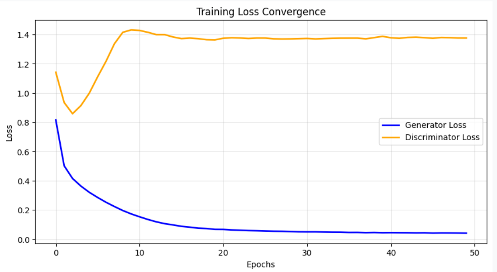
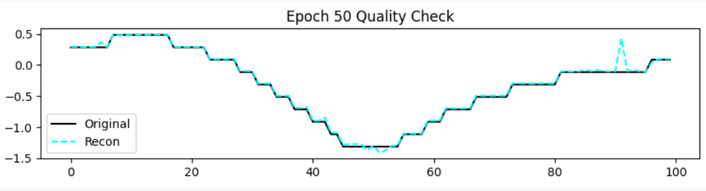
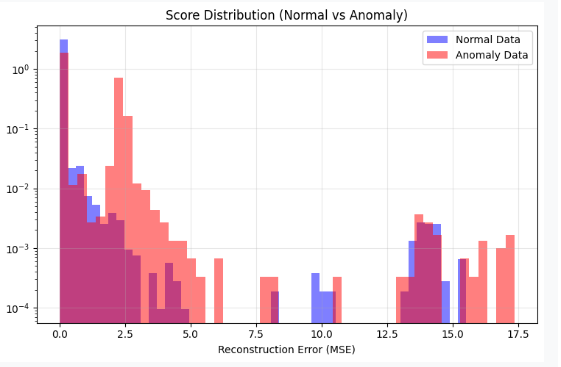
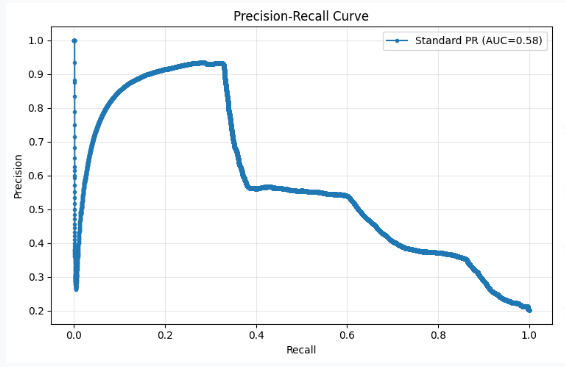
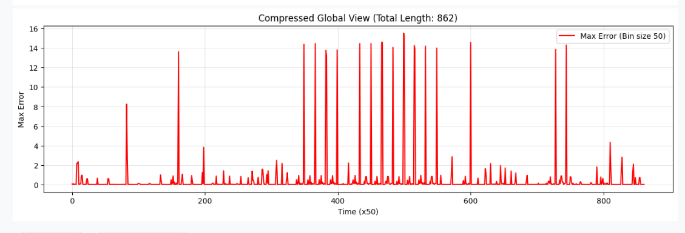

# Transformer-GAN for Time-Series Anomaly Detection (TranAD-GAN)

## 🎯 Project Overview

This repository implements an **unsupervised Transformer-based Generative Adversarial Network (GAN)** for detecting anomalies in multivariate time-series data. The model leverages the sequence modeling capabilities of Transformers combined with the reconstruction-based anomaly detection approach of GANs.

* **Goal:** Detect anomalies in sensor data (e.g., NASA SMAP/MSL) without requiring labeled anomaly examples during training.
* **Method:** **Unsupervised Reconstruction.** The model learns "normal" patterns, and large reconstruction errors during testing indicate anomalies.
* **Evaluation:** Validated using **Synthetic Anomaly Injection** to ensure robustness.

---

## 📊 1. Dataset & Preprocessing

### Preprocessing Pipeline

1.  **Z-Score Normalization:** Data is normalized to $\text{Mean}=0$ and $\text{Std}=1$. This scaling is critical for anomaly detection as it preserves the **magnitude of outliers** relative to the noise.
    $$x' = \frac{x - \mu}{\sigma + \epsilon}$$
2.  **Sliding Windows:** The continuous time series is sliced into fixed-length windows (Size: **100** steps, Stride: **10** steps).
3.  **Geometric Masking (Augmentation):** During training, random blocks of the input time-series window are masked (set to 0). This forces the Transformer Generator to learn contextual dependencies to reconstruct the missing information.

---

## 🧠 2. Model Architecture

The framework is built on two competing networks: the Generator (Transformer) and the Discriminator (MLP).

### The Generator (Transformer Encoder-Decoder)

The Generator reconstructs the input window, ensuring the output is structurally valid.
* **Architecture:** Two-layer Transformer Encoder followed by a Two-layer Transformer Decoder.
* **Mechanism:** Uses **Positional Encoding** to preserve sequential order and utilizes the Encoder's output as the context for the Decoder.

### The Discriminator

The Discriminator attempts to distinguish between the original real window and the reconstructed fake window.

---

## ⚙️ 3. Training Procedure

The model is trained for **50 Epochs** using a composite loss function to balance reconstruction quality, latent representation, and adversarial dynamics.

### Loss Components

1.  **Reconstruction Loss ($L_{rec}$):** **MSE** between the Input and the Reconstructed Output.
2.  **Contrastive Loss ($L_{cont}$):** **InfoNCE loss** applied to the latent vectors ($\mathbf{z}$) derived from the Encoder, ensuring features from augmented views of the same window are similar.
3.  **Adversarial Loss ($L_{adv}$):** Standard GAN loss, optimizing the Generator to fool the Discriminator.

### Training Convergence

The plot below shows the **Generator Loss (Blue)** decreasing smoothly, signifying that the model successfully learned to reconstruct the data.

### Reconstruction Quality Check

At the end of training (Epoch 50), the model demonstrates high fidelity in reconstructing complex time-series patterns.

---

## 🧪 4. Evaluation & Results

Evaluation is performed using **Synthetic Anomaly Injection**, where spikes, drops, and noise are deliberately added to the test data.

### Anomaly Score Distribution

This visualization is key to evaluating model effectiveness. The histogram confirms the model's success by clearly separating the reconstruction errors:
* **Blue (Normal):** Concentrated at low error values.
* **Red (Anomaly):** Pushed toward higher error values.

### Final Quantitative Results

| Metric | Score | Description |
| :--- | :--- | :--- |
| **AUPRC** | **0.5426** | Area Under Precision-Recall Curve (Threshold-independent performance). |
| **Best Standard F1** | **0.5343** | F1 Score at the optimal threshold. |
| **Point Adjusted F1 (PA F1)** | **0.5927** | F1 Score using the lenient PA metric. |

### Precision-Recall Curve

The PR curve shows a moderate performance ($AUC=0.58$), indicating the need for careful threshold selection.

### Anomaly Visualization

The compressed view of the full test set reconstruction error shows distinct, high **Red Spikes**, confirming that the model reacts strongly to the injected anomalies.

---

## 🚀 How to Run

1.  **Upload Data:** Ensure your multi-dimensional `.npy` files are accessible in `/kaggle/input`.
2.  **Run Cell 1 & 2:** Prepare data and initialize the `TransformerGAN` and `Discriminator`.
3.  **Run Cell 3:** Execute `train_final_model(epochs=50)`.
4.  **Run Cell 4:** Execute `evaluate_comprehensive_metrics(model, test_loader)` to perform synthetic injection, calculate metrics, and generate the result plots.
